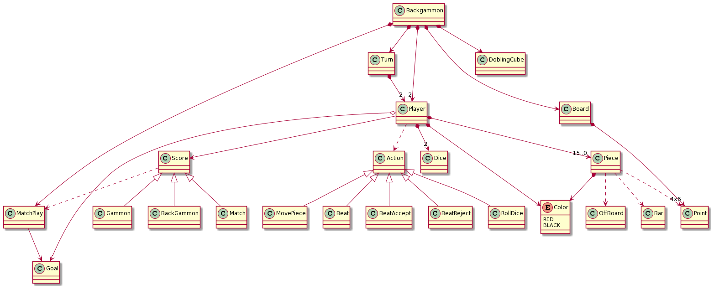
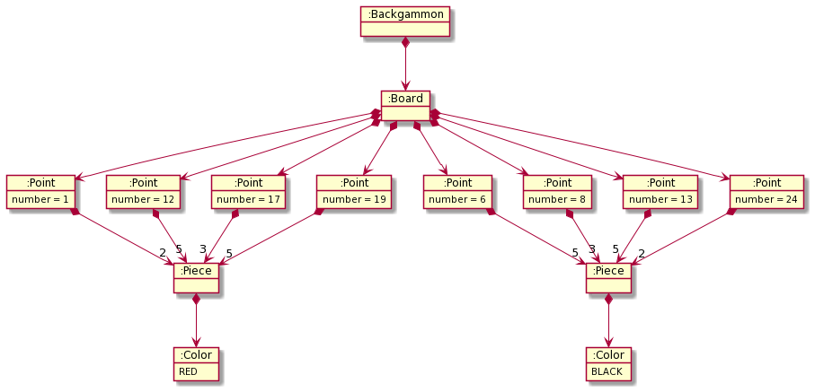

# Backgammon

## Rules

* [Wikipedia English](https://en.wikipedia.org/wiki/Backgammon#Rules)
* [Rules in video (Spanish)](https://www.youtube.com/watch?v=Bx9TYzBzHSM)


## Domain model




## Initial state




## Console GUI

```
### BACKGAMMON ###

MatchPlay points? (10): bad
MatchPlay points? (10): 10

Each player should choose a color. Press Enter for starting.


- Starting game -

BLACK Dice: 5
RED Dice: 5
Repeating first roll.
BLACK Dice: 4
RED Dice: 1

|-----------------------------------------------------|
| 13  14  15  16  17  18 |   | 19  20  21  22  23  24 |
| 5b              3r     |   | 5r                  2b |
|                        |   |                        |
|                        |BAR|                        |
|                        |   |                        |
| 5r              3b     |   | 5b                  2r |
| 12  11  10   9   8   7 |   |  6   5   4   3   2   1 |
|-----------------------------------------------------|

BLACK turn:
1) Move 4
2) Move 1
3) End turn
Select your choice: bad
Select your choice: 1
Select Point: bad
Select Point: 24

|-----------------------------------------------------|
| 13  14  15  16  17  18 |   | 19  20  21  22  23  24 |
| 5b              3r     |   | 5r  1b              1b |
|                        |   |                        |
|                        |BAR|                        |
|                        |   |                        |
| 5r              3b     |   | 5b                  2r |
| 12  11  10   9   8   7 |   |  6   5   4   3   2   1 |
|-----------------------------------------------------|

BLACK turn:
1) Move 1
2) End turn
Select your choice: 1
Select Point: 20
Illegal move.
Select Point: 8

|-----------------------------------------------------|
| 13  14  15  16  17  18 |   | 19  20  21  22  23  24 |
| 5b              3r     |   | 5r  1b              1b |
|                        |   |                        |
|                        |BAR|                        |
|                        |   |                        |
| 5r              2b  1b |   | 5b                  2r |
| 12  11  10   9   8   7 |   |  6   5   4   3   2   1 |
|-----------------------------------------------------|


RED Turn:
1) Roll dice
2) Double bet
Select your choice: 1

|-----------------------------------------------------|
| 12  11  10   9   8   7 |   |  6   5   4   3   2   1 |
| 5b              3r     |   | 5r  1b              1b |
|                        |   |                        |
|                        |BAR|                        |
|                        |   |                        |
| 5r              2b  1b |   | 5b                  2r |
| 13  14  15  16  17  18 |   | 19  20  21  22  23  24 |
|-----------------------------------------------------|

Dice: 3
Dice: 3

1) Move 3
2) Move 3
3) Move 3
4) Move 3
5) End turn
Select choice: 1
Select point: 8

|-----------------------------------------------------|
| 12  11  10   9   8   7 |   |  6   5   4   3   2   1 |
| 5b              2r     |   | 5r  1r              1b |
|                        | 1b|                        |
|                        |BAR|                        |
|                        |   |                        |
| 5r              2b  1b |   | 5b                  2r |
| 13  14  15  16  17  18 |   | 19  20  21  22  23  24 |
|-----------------------------------------------------|

1) Move 3
2) Move 3
3) Move 3
4) End turn
Select choice: 4


BALCK Turn:
1) Roll dice
2) Double bet
Select your choice: 1


|-----------------------------------------------------|
| 13  14  15  16  17  18 |   | 19  20  21  22  23  24 |
| 5b              2r     |   | 5r  1r              1b |
|                        | 1b|                        |
|                        |BAR|                        |
|                        |   |                        |
| 5r              2b  1b |   | 5b                  2r |
| 12  11  10   9   8   7 |   |  6   5   4   3   2   1 |
|-----------------------------------------------------|

Dice: 4
Dice: 3

1) Move 4
2) Move 3
3) End turn
Select choice: 2
Select point: 24
Illegal move.
Select point: BAR


|-----------------------------------------------------|
| 13  14  15  16  17  18 |   | 19  20  21  22  23  24 |
| 5b              2r     |   | 5r  1r      1b      1b |
|                        |   |                        |
|                        |BAR|                        |
|                        |   |                        |
| 5r              2b  1b |   | 5b                  2r |
| 12  11  10   9   8   7 |   |  6   5   4   3   2   1 |
|-----------------------------------------------------|


1) Move 4
2) End turn
Select choice: 1
Select point: 24

|-----------------------------------------------------|
| 13  14  15  16  17  18 |   | 19  20  21  22  23  24 |
| 5b              2r     |   | 5r  1b              1b |
|                        |   |                        |
|                        |BAR|                        |
|                        | 1r|                        |
| 5r              2b  1b |   | 5b                  2r |
| 12  11  10   9   8   7 |   |  6   5   4   3   2   1 |
|-----------------------------------------------------|


```

