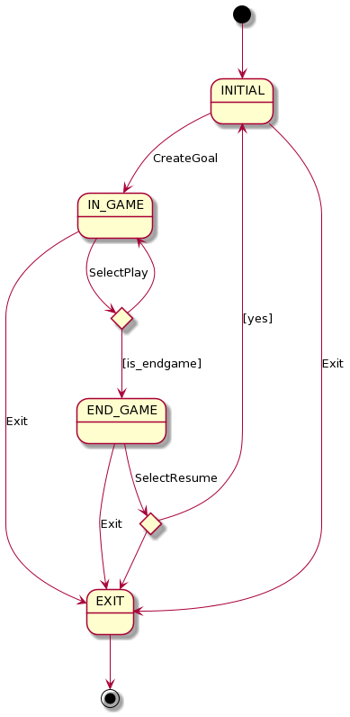

# Backgammon

## Rules

* [Wikipedia English](docs/https://en.wikipedia.org/wiki/Backgammon#Rules)
* [Rules in video (Spanish)](docs/https://www.youtube.com/watch?v=Bx9TYzBzHSM)


## Domain model


## Initial state


## Console GUI

```
### BACKGAMMON ###

MatchPlay points? (10): bad
MatchPlay points? (10): 10

Each player should choose a color. Press Enter for starting.


- Starting game -

BLACK Dice: 5
RED Dice: 5
Repeating first roll.
BLACK Dice: 4
RED Dice: 1

|-----------------------------------------------------|
| 13  14  15  16  17  18 |   | 19  20  21  22  23  24 |
| 5b              3r     |   | 5r                  2b |
|                        |   |                        |
|                        |BAR|                        |
|                        |   |                        |
| 5r              3b     |   | 5b                  2r |
| 12  11  10   9   8   7 |   |  6   5   4   3   2   1 |
|-----------------------------------------------------|

BLACK turn:
1) Move 4
2) Move 1
3) End turn
Select your choice: bad
Select your choice: 1
Select Point: bad
Select Point: 24

|-----------------------------------------------------|
| 13  14  15  16  17  18 |   | 19  20  21  22  23  24 |
| 5b              3r     |   | 5r  1b              1b |
|                        |   |                        |
|                        |BAR|                        |
|                        |   |                        |
| 5r              3b     |   | 5b                  2r |
| 12  11  10   9   8   7 |   |  6   5   4   3   2   1 |
|-----------------------------------------------------|

BLACK turn:
1) Move 1
2) End turn
Select your choice: 1
Select Point: 20
Illegal move.
Select Point: 8

|-----------------------------------------------------|
| 13  14  15  16  17  18 |   | 19  20  21  22  23  24 |
| 5b              3r     |   | 5r  1b              1b |
|                        |   |                        |
|                        |BAR|                        |
|                        |   |                        |
| 5r              2b  1b |   | 5b                  2r |
| 12  11  10   9   8   7 |   |  6   5   4   3   2   1 |
|-----------------------------------------------------|


RED Turn:
1) Roll dice
2) Double bet
Select your choice: 1

|-----------------------------------------------------|
| 12  11  10   9   8   7 |   |  6   5   4   3   2   1 |
| 5b              3r     |   | 5r  1b              1b |
|                        |   |                        |
|                        |BAR|                        |
|                        |   |                        |
| 5r              2b  1b |   | 5b                  2r |
| 13  14  15  16  17  18 |   | 19  20  21  22  23  24 |
|-----------------------------------------------------|

Dice: 3
Dice: 3

1) Move 3
2) Move 3
3) Move 3
4) Move 3
5) End turn
Select choice: 1
Select point: 8

|-----------------------------------------------------|
| 12  11  10   9   8   7 |   |  6   5   4   3   2   1 |
| 5b              2r     |   | 5r  1r              1b |
|                        | 1b|                        |
|                        |BAR|                        |
|                        |   |                        |
| 5r              2b  1b |   | 5b                  2r |
| 13  14  15  16  17  18 |   | 19  20  21  22  23  24 |
|-----------------------------------------------------|

1) Move 3
2) Move 3
3) Move 3
4) End turn
Select choice: 4


BLACK Turn:
1) Roll dice
2) Double bet
Select your choice: 1


|-----------------------------------------------------|
| 13  14  15  16  17  18 |   | 19  20  21  22  23  24 |
| 5b              2r     |   | 5r  1r              1b |
|                        | 1b|                        |
|                        |BAR|                        |
|                        |   |                        |
| 5r              2b  1b |   | 5b                  2r |
| 12  11  10   9   8   7 |   |  6   5   4   3   2   1 |
|-----------------------------------------------------|

Dice: 4
Dice: 3

1) Move 4
2) Move 3
3) End turn
Select choice: 2
Select point: 24
Illegal move.
Select point: BAR


|-----------------------------------------------------|
| 13  14  15  16  17  18 |   | 19  20  21  22  23  24 |
| 5b              2r     |   | 5r  1r      1b      1b |
|                        |   |                        |
|                        |BAR|                        |
|                        |   |                        |
| 5r              2b  1b |   | 5b                  2r |
| 12  11  10   9   8   7 |   |  6   5   4   3   2   1 |
|-----------------------------------------------------|


1) Move 4
2) End turn
Select choice: 1
Select point: 24

|-----------------------------------------------------|
| 13  14  15  16  17  18 |   | 19  20  21  22  23  24 |
| 5b              2r     |   | 5r  1b              1b |
|                        |   |                        |
|                        |BAR|                        |
|                        | 1r|                        |
| 5r              2b  1b |   | 5b                  2r |
| 12  11  10   9   8   7 |   |  6   5   4   3   2   1 |
|-----------------------------------------------------|

```

## Context



## Use Cases


### RollDice


### ConfigureMatchPlay


### MovePiece
General Rules:
- Each player must move the maximum number of possible movements according to the dices.
- In the particular case of have only one piece able to move, only by the value of
  the dices but not with the sum of both dices, the player must choose the biggest dice.
- The pieces must leave the board using the exact number needed for it. A higher number
  than necessary can only be used to draw a piece when there is no other left in any of the
  previous squares.

Spanish Translate:
- En cada turno es obligatorio realizar el máximo número de movimientos posibles en
  función de los valores de los dados.
- En particular, en caso de disponer de una sola ficha que puede moverse por el valor
  de ambos dados, pero no la suma de ambos, deberá escogerse el mayor de los dos
  valores.
- Las piezas deben salir del tablero utilizando el número exacto necesitado para ello.
  Solo podrá utilizarse un número más alto del preciso para sacar una pieza cuando no
  quede ninguna otra en ninguna de las casillas anteriores.


## Analysis (MVP-PV)


## Execute application

NOTE: you need python 3.9

```
python3 main.py
```

## Development

Create python virtual environment with python 3.9:

```
python3 -m venv env
```

Activate virtual environment:

```
source env/bin/activate
```

Install development dependencies:

```
pip install -r requirements-dev.txt
```

### Check lint

```
make lint
```

or

```
prospector
```

### Check hint typing

```
make mypy
```

or

```
mypy src
```

### Run tests

```
make test
```

or

```
python -m unittest
```
